# AceFluency — App Screenshot Catalog

Visual reference cataloging all screenshots in `screenshots/`. Each entry embeds the image with a short description of the screen/feature shown and any notable UI details (pricing, copy, states). Ordered chronologically by filename timestamp. Companion to the surface map in `_bmad-output/planning-artifacts/prds/prd-community-2026-06-09/addendum.md` §H.

78 screenshots total.

---

### 1. Ace Fluency Pro — subscription plans (top)
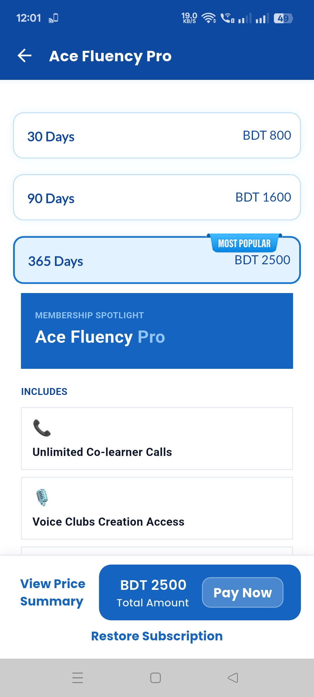

Subscription screen, Bangladesh pricing tier: 30 Days (BDT 800), 90 Days (BDT 1600), 365 Days (BDT 2500, marked "MOST POPULAR"). Below, a "Membership Spotlight" banner for Ace Fluency Pro lists included perks starting with "Unlimited Co-learner Calls" and "Voice Clubs Creation Access". Bottom sticky bar shows "View Price Summary", total amount (BDT 2500), and a "Pay Now" button, plus a "Restore Subscription" link.

### 2. Ace Fluency Pro — subscription plans (scrolled, counsellor CTA)
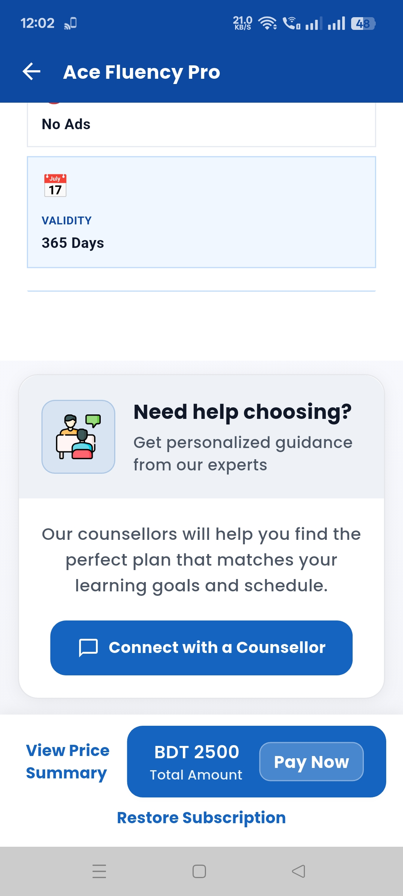

Same subscription screen scrolled down: "No Ads" perk, a validity card ("July 17" / "VALIDITY 365 Days"), and a "Need help choosing?" card offering to "Connect with a Counsellor" for personalized plan guidance. Same sticky Pay Now footer (BDT 2500).

### 3. Home tab — Group Discussions live, call types, advanced-learner talk
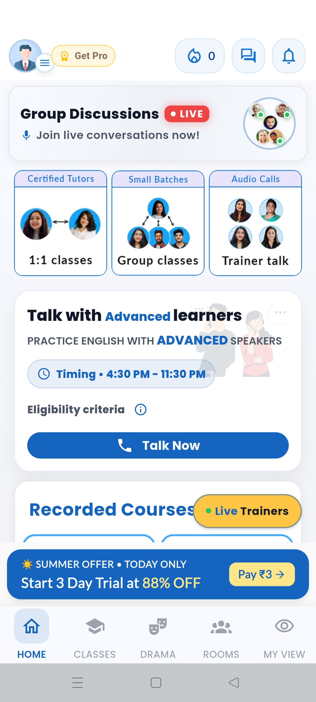

Home tab. Top bar: avatar, "Get Pro" pill, streak counter (0), chat icon, notification bell. "Group Discussions • LIVE — Join live conversations now!" banner with live participant avatars. Three feature cards: "Certified Tutors" (1:1 classes), "Small Batches" (Group classes), "Audio Calls" (Trainer talk). Below, "Talk with Advanced learners" card: "PRACTICE ENGLISH WITH ADVANCED SPEAKERS", timing 4:30 PM–11:30 PM, an "Eligibility criteria" info toggle, and a "Talk Now" button. "Recorded Courses" section begins, with a "Live Trainers" badge and a "Summer Offer" banner ("Start 3 Day Trial at 88% OFF — Pay ₹3"). Bottom nav: Home, Classes, Drama, Rooms, My View.

### 4. Home tab — Recorded Courses (Video/Audio) and Summer Offer
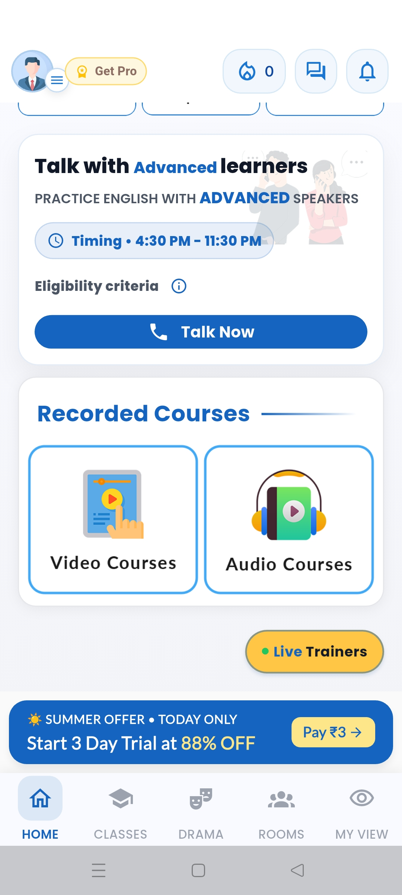

Home tab scrolled to "Recorded Courses" section with two content-type cards: "Video Courses" and "Audio Courses". "Live Trainers" badge and the "SUMMER OFFER • TODAY ONLY — Start 3 Day Trial at 88% OFF" banner with "Pay ₹3" CTA remain pinned above the bottom nav (Home active).

### 5. Classes tab — Personal Coaching carousel + trial booking
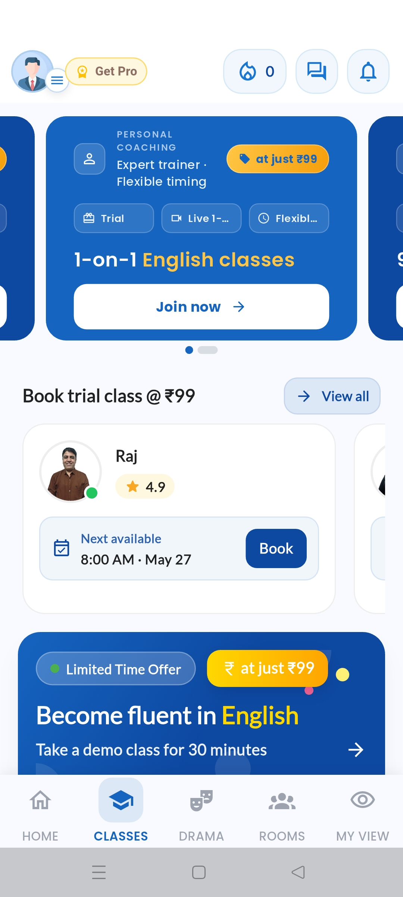

Classes tab. Carousel card: "PERSONAL COACHING — Expert trainer · Flexible timing", tag "at just ₹99", chips for Trial / Live 1-on-1 / Flexible, heading "1-on-1 English classes", "Join now" button. Below: "Book trial class @ ₹99" with a tutor card — "Raj", 4.9★ rating, "Next available 8:00 AM · May 27" with a "Book" button.

### 6. Classes tab — demo class offer and subscription CTA
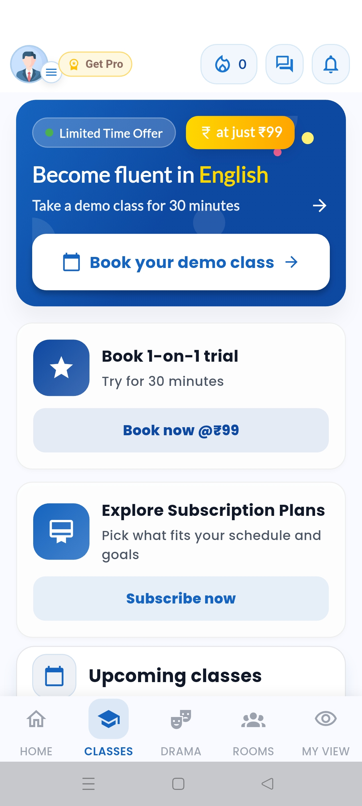

Classes tab scrolled further: "Limited Time Offer — at just ₹99" banner, "Become fluent in English — Take a demo class for 30 minutes" with a "Book your demo class" button. Then two stacked cards: "Book 1-on-1 trial" ("Try for 30 minutes", "Book now @ ₹99") and "Explore Subscription Plans" ("Pick what fits your schedule and goals", "Subscribe now"), and the start of an "Upcoming classes" section.

### 7. Classes tab — empty "Upcoming classes" state
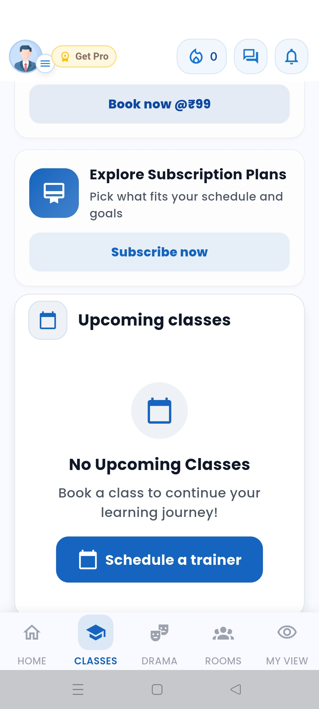

Classes tab, "Upcoming classes" section in its empty state: calendar icon, "No Upcoming Classes", "Book a class to continue your learning journey!", and a "Schedule a trainer" button. "Explore Subscription Plans" card remains above it.

### 8. Classes tab — empty "Upcoming classes" state (scrolled further)
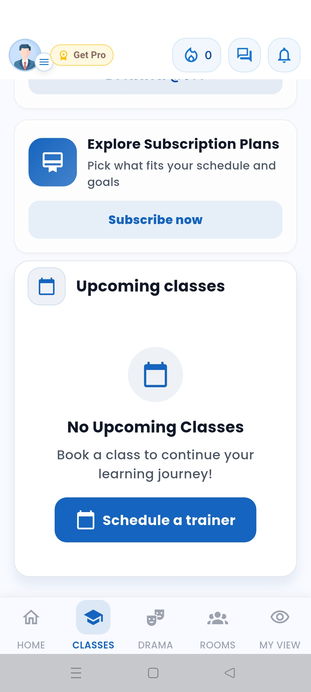

Near-duplicate of the previous screen, scrolled slightly further so "Explore Subscription Plans" sits higher and the empty "No Upcoming Classes" state with "Schedule a trainer" button is fully in view.

### 9. Rooms tab — Rooms by Category with "Don't Stumble" expert-talk interstitial
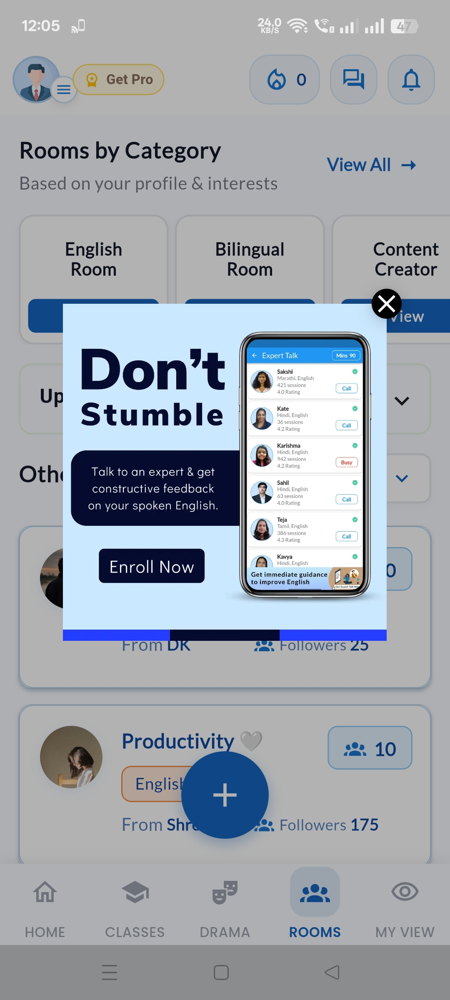

Rooms tab, "Rooms by Category (Based on your profile & interests)" grid (English Room, Bilingual Room, Content Creator, each with a "View" button), partially obscured by a modal interstitial: "Don't Stumble — Talk to an expert & get constructive feedback on your spoken English", with a mini phone mockup of an "Expert Talk" tutor list (names, languages, session counts, ratings, Call/Busy buttons) and an "Enroll Now" CTA.

### 10. Rooms tab — category grid, Upcoming Rooms, Other Live Rooms
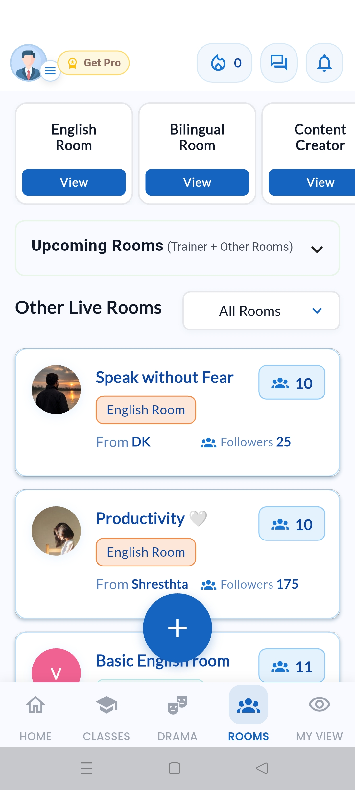

Rooms tab with the interstitial dismissed: English Room / Bilingual Room / Content Creator category cards, a collapsed "Upcoming Rooms (Trainer + Other Rooms)" section, and "Other Live Rooms" with an "All Rooms" filter dropdown. Room cards shown: "Speak without Fear" (English Room, from DK, 10 cap, 25 followers) and "Productivity" (English Room, from Shresthta, 10 cap, 175 followers), plus a "Basic English room" card starting to appear.

### 11. Rooms tab — Upcoming Rooms expanded (Trainer Room)
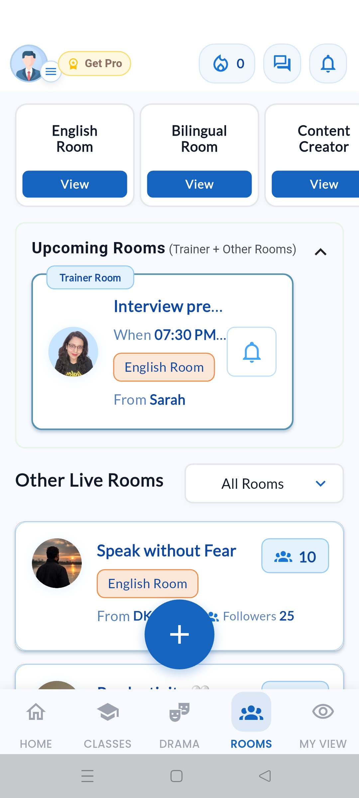

Same Rooms tab with "Upcoming Rooms" expanded, showing a "Trainer Room" card: "Interview pre…" session, "When 07:30 PM…", tagged English Room, hosted "From Sarah", with a notification bell toggle. "Other Live Rooms" list begins below with "Speak without Fear".

### 12. Rooms tab — Other Live Rooms list (scrolled)
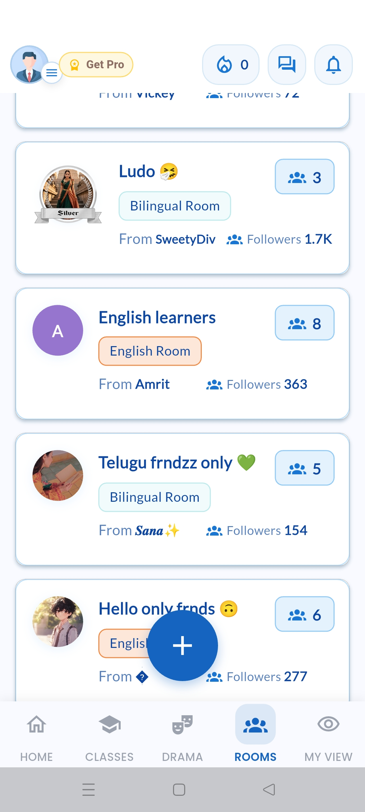

"Other Live Rooms" list scrolled further: room cards "Ludo 😝" (Bilingual Room, from SweetyDiv, 3 cap, 1.7K followers, "Silver" badge avatar), "English learners" (English Room, from Amrit, 8 cap, 363 followers), "Telugu frndzz only 💚" (Bilingual Room, from Sana✨, 5 cap, 154 followers), and "Hello only frnds 🙃" (English Room, 6 cap, 277 followers) starting to appear.

### 13. Rooms tab — Other Live Rooms list (further scroll)
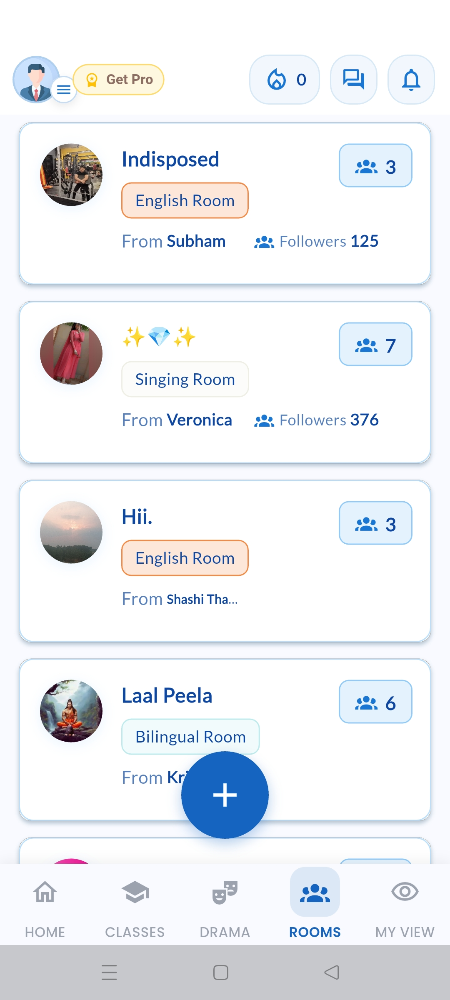

Further down the same list: "Indisposed" (English Room, from Subham, 3 cap, 125 followers), "✨💎✨" (Singing Room, from Veronica, 7 cap, 376 followers — a non-English/Bilingual room category example), "Hii." (English Room, from Shashi Tha…, 3 cap), and "Laal Peela" (Bilingual Room, from Kr…, 6 cap).

### 14. Rooms tab — Room Creation paywall modal
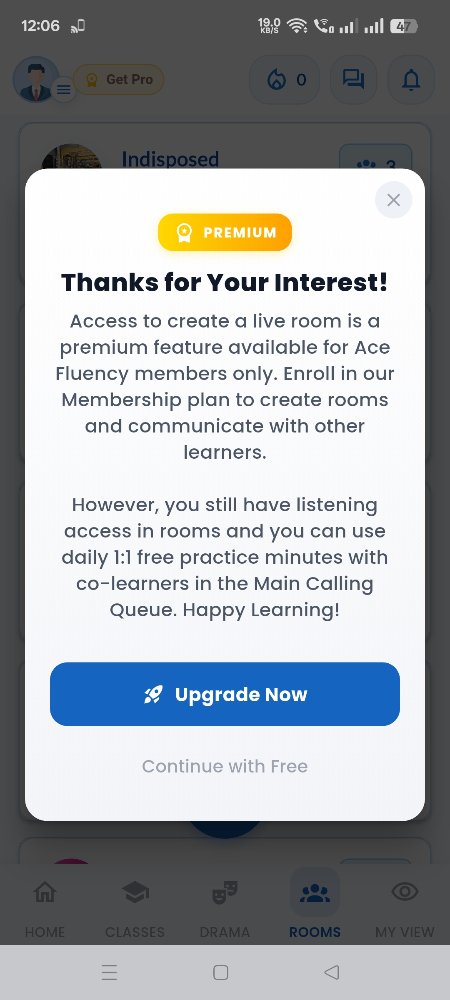

Soft-paywall modal triggered from the Rooms tab (likely tapping the "+" create-room FAB): "PREMIUM — Thanks for Your Interest! Access to create a live room is a premium feature available for Ace Fluency members only." Explains listening access and daily 1:1 free practice minutes remain free. CTAs: "🚀 Upgrade Now" and a "Continue with Free" text link.

### 15. My View tab — Daily Speaking Streak
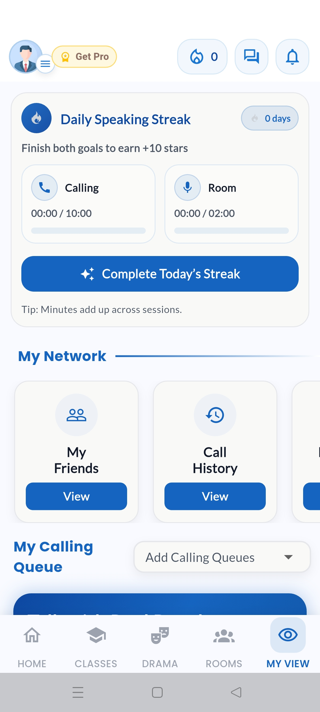

My View tab, top section: "Daily Speaking Streak" card showing "0 days", "Finish both goals to earn +10 stars" with two sub-goals — "Calling 00:00 / 10:00" and "Room 00:00 / 02:00" (both empty progress bars) — and a "✨ Complete Today's Streak" button with tip "Minutes add up across sessions." Below, "My Network" section begins with "My Friends" and "Call History" cards (each with a "View" button), and "My Calling Queue" with an "Add Calling Queues" dropdown.

### 16. My View tab — Calling Queue, Communities, AI speaking test
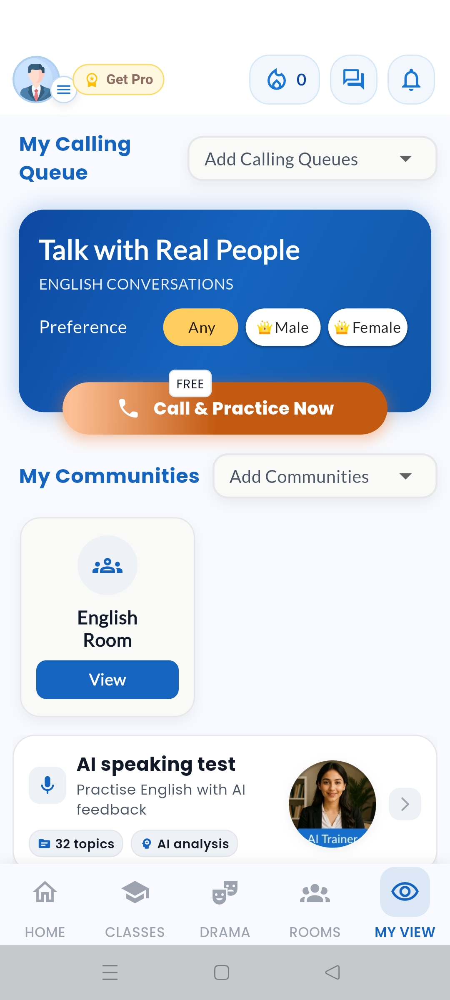

My View tab scrolled to "My Calling Queue" with an "Add Calling Queues" dropdown and a "Talk with Real People — ENGLISH CONVERSATIONS" card offering gender Preference (Any / 👑 Male / 👑 Female, the crown marking a paid gate) and a "FREE Call & Practice Now" button. Below, "My Communities" (Add Communities dropdown) shows an "English Room" community card, and an "AI speaking test" card begins: "Practise English with AI feedback", "32 topics", "AI analysis", with an AI Trainer avatar.

### 17. My View tab — Communities, AI speaking test, Recorded Courses
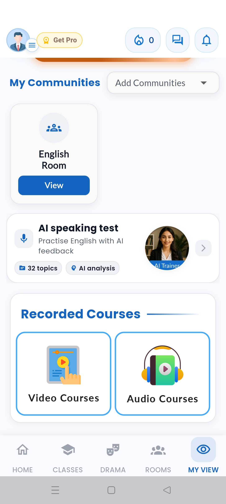

My View tab further scrolled: "My Communities" (English Room card), "AI speaking test" card ("Practise English with AI feedback", 32 topics, AI analysis, AI Trainer avatar), and the start of a "Recorded Courses" section with Video Courses / Audio Courses cards — mirroring the Home tab's Recorded Courses module.

### 18. Community Guidelines modal (onboarding/legal gate)
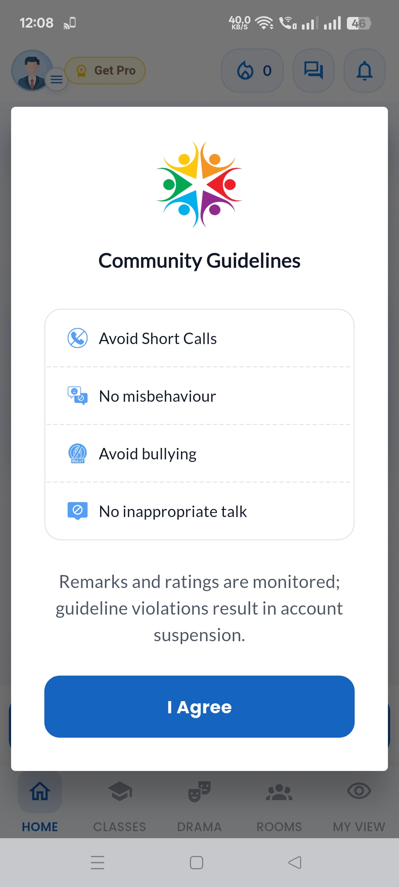

Full-screen "Community Guidelines" modal shown over the Home tab: colorful multi-figure logo, four rules with icons — "Avoid Short Calls", "No misbehaviour", "Avoid bullying", "No inappropriate talk" — followed by "Remarks and ratings are monitored; guideline violations result in account suspension." Single "I Agree" button, no way to decline/dismiss visible. This is the mandatory moderation-policy gate referenced in the PRD addendum.

### 19. Matching flow — "Hang on! We're finding a Co-Learner for you"
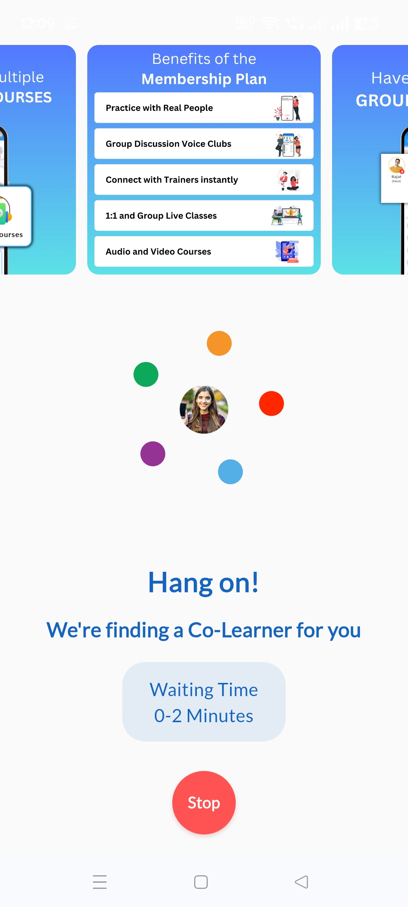

Matchmaking/waiting screen for the co-learner calling queue. Top shows a partial "Benefits of the Membership Plan" upsell carousel (Practice with Real People, Group Discussion Voice Clubs, Connect with Trainers instantly, 1:1 and Group Live Classes, Audio and Video Courses) behind an avatar with colored orbit dots (an animated "searching" motif), then "Hang on! We're finding a Co-Learner for you", "Waiting Time 0-2 Minutes", and a red "Stop" button to cancel the search.

### 20. Active 1:1 call screen with matched partner
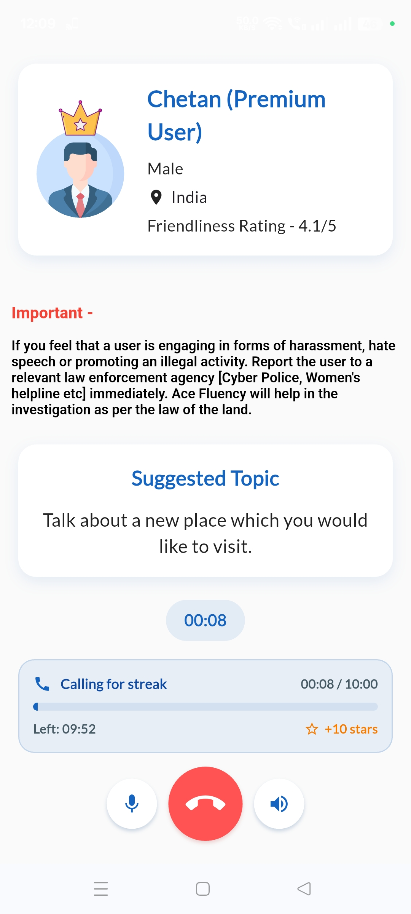

Live call screen after a match: partner card "Chetan (Premium User)" with a crown icon, Male, India, "Friendliness Rating - 4.1/5". A red "Important" safety notice instructs reporting harassment/hate speech/illegal activity to law enforcement (Cyber Police, Women's helpline), with Ace Fluency stating it will assist investigations. A "Suggested Topic" card reads "Talk about a new place which you would like to visit." Call timer 00:08, a "Calling for streak" progress bar (00:08 / 10:00, "Left: 09:52", "+10 stars"), and call controls (mute, end call, speaker).

### 21. Post-call rating modal — "Rate your last caller"
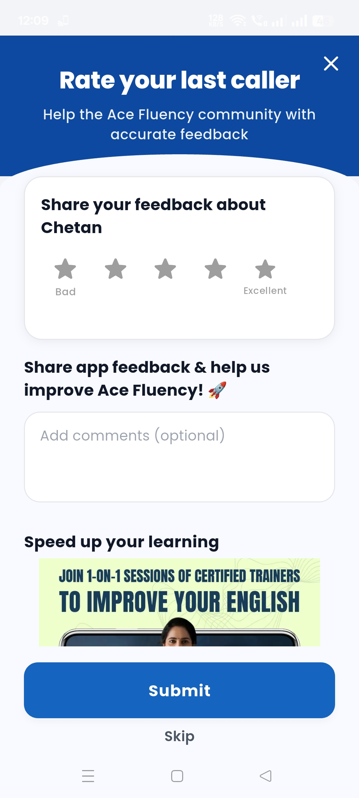

Post-call feedback modal: "Rate your last caller — Help the Ace Fluency community with accurate feedback", "Share your feedback about Chetan" with a 5-star row (Bad → Excellent), an optional comments box ("Share app feedback & help us improve Ace Fluency! 🚀"), a promo banner for 1-on-1 certified-trainer sessions, a "Submit" button, and a "Skip" link. Confirms the post-call rating + friendliness-rating feature already exists.

### 22. Course detail — "Still confused?" WhatsApp counsellor interstitial
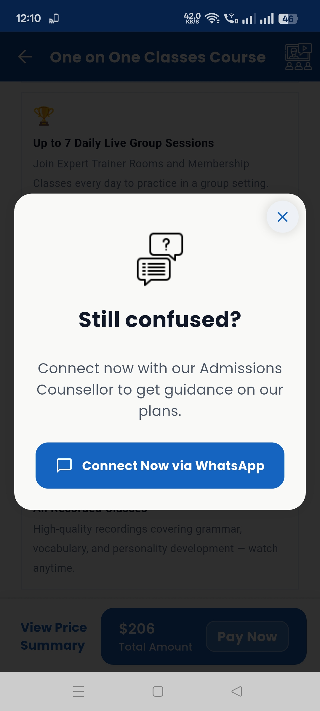

"One on One Classes Course" detail page (course benefit: "🏆 Up to 7 Daily Live Group Sessions — Join Expert Trainer Rooms and Membership Classes every day") partially obscured by a "Still confused? Connect now with our Admissions Counsellor to get guidance on our plans." modal with a "Connect Now via WhatsApp" button. Sticky footer below shows total $206, "Pay Now" — an India/USD-denominated price point.

### 23. 90-Day Spoken English Course — Premium Group Classes detail
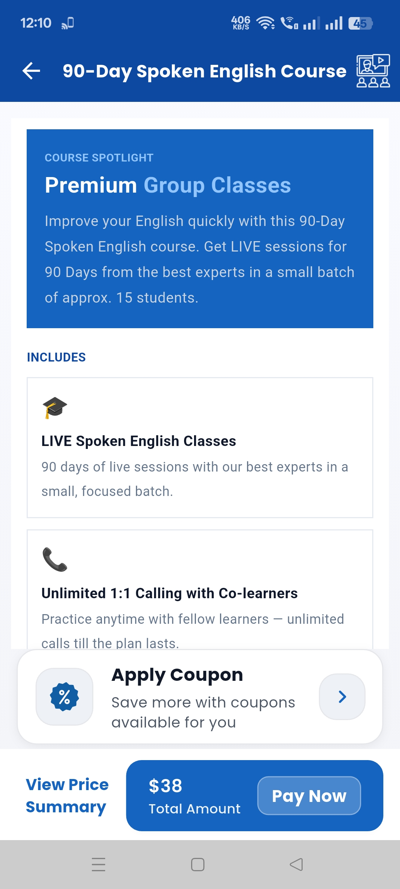

"90-Day Spoken English Course" detail page. "COURSE SPOTLIGHT — Premium Group Classes" banner: "Improve your English quickly with this 90-Day Spoken English course. Get LIVE sessions for 90 Days from the best experts in a small batch of approx. 15 students." Includes list: "LIVE Spoken English Classes" and "Unlimited 1:1 Calling with Co-learners". "Apply Coupon" row. Sticky footer: $38 total, "Pay Now".

### 24. 90-Day Spoken English Course — validity + counsellor CTA
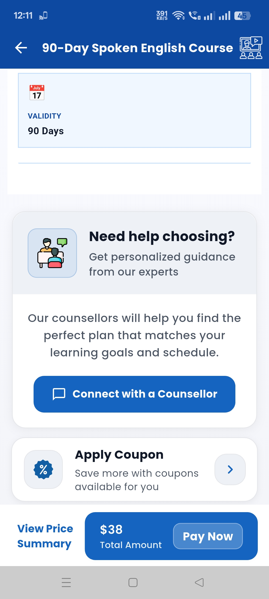

Same course page scrolled: validity card ("July 17" / "VALIDITY 90 Days"), "Need help choosing? — Connect with a Counsellor" card, and an "Apply Coupon" row. Sticky footer again shows $38 total / "Pay Now" — confirms this course tier is priced in USD (distinct from the BDT/INR subscription tiers), a third currency/price point beyond the BD and IN plans noted elsewhere.

### 25. 90-Day Spoken English Course — "Still confused?" interstitial (duplicate visit)
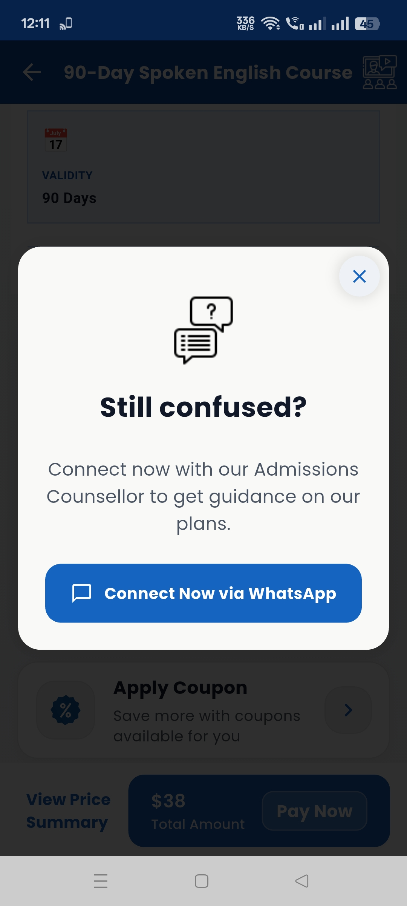

Same "Still confused? Connect now with our Admissions Counsellor" WhatsApp modal reappearing over the 90-Day Spoken English Course page (validity 90 Days, $38 total) — shown again later in the session, suggesting it's a recurring/frequent interstitial rather than a one-time prompt.

### 26. Classes tab — "All / My Classes / History" tutor booking list
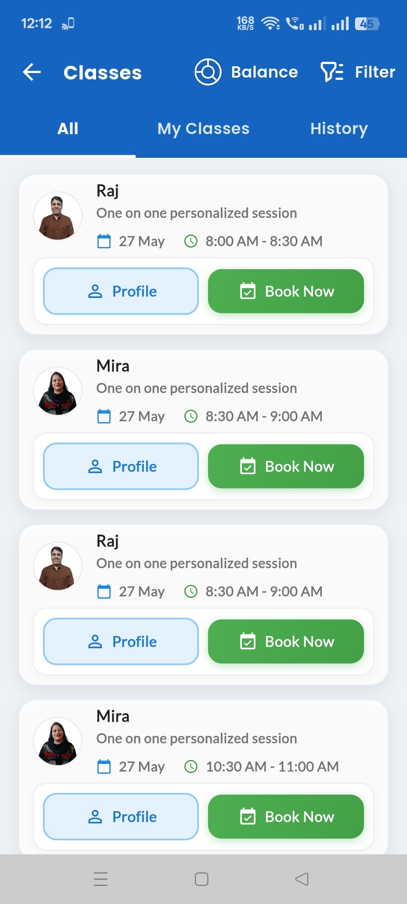

A tutor-session booking list (reached from Classes), with a top bar "Classes — Balance — Filter" and tabs "All / My Classes / History". Lists individual bookable slots: Raj (8:00–8:30 AM), Mira (8:30–9:00 AM), Raj (8:30–9:00 AM), Mira (10:30–11:00 AM), each a "One on one personalized session" on 27 May with "Profile" and "Book Now" buttons.

### 27. AI Speaking Test — "Choose a topic" list
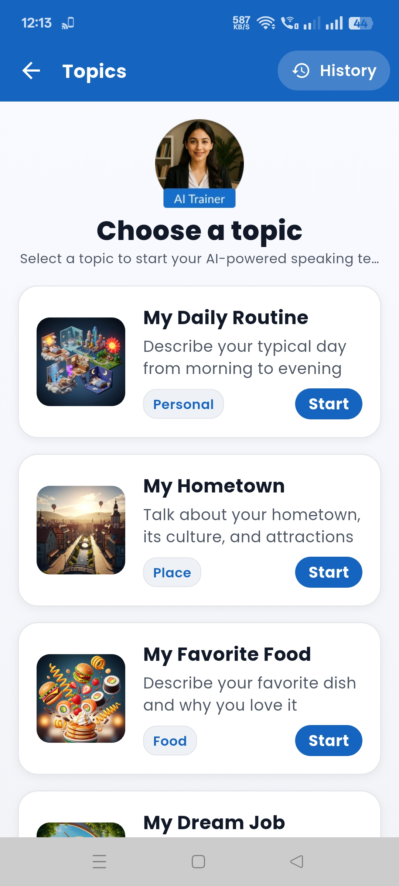

AI Speaking Test "Topics" screen: AI Trainer avatar, "Choose a topic — Select a topic to start your AI-powered speaking te…", a "History" button top-right. Topic cards with illustration, category tag, and "Start" button: "My Daily Routine" (Personal), "My Hometown" (Place), "My Favorite Food" (Food), "My Dream Job" beginning to show — confirms the "32 topic cards" feature.

### 28. AI Speaking Test — active test screen, 60s timer
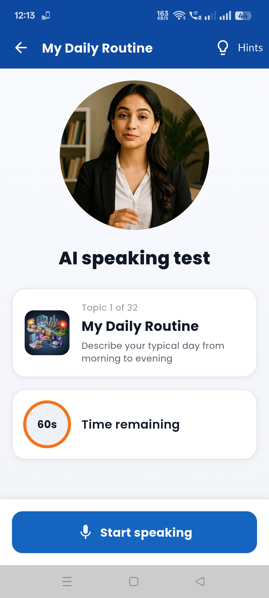

Active AI speaking test for "My Daily Routine" (Topic 1 of 32): AI Trainer persona image, prompt "Describe your typical day from morning to evening", a 60s circular countdown labeled "Time remaining", and a "🎤 Start speaking" button — confirms the "60s per topic" mechanic.

### 29. AI Speaking Test — "Speaking Test History" paywall
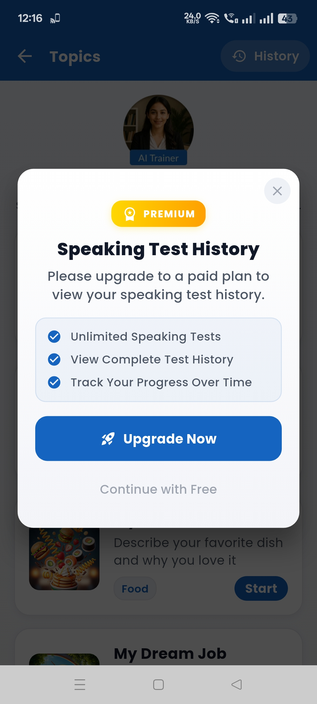

Hard-paywall modal triggered by tapping "History" on the Topics screen: "PREMIUM — Speaking Test History — Please upgrade to a paid plan to view your speaking test history." Checklist: Unlimited Speaking Tests, View Complete Test History, Track Your Progress Over Time. CTAs: "🚀 Upgrade Now" / "Continue with Free". Confirms the hard paywall on AI Speaking Test history noted in the PRD addendum.

### 30. Trainer Talk — browsable tutor list with Play/Call
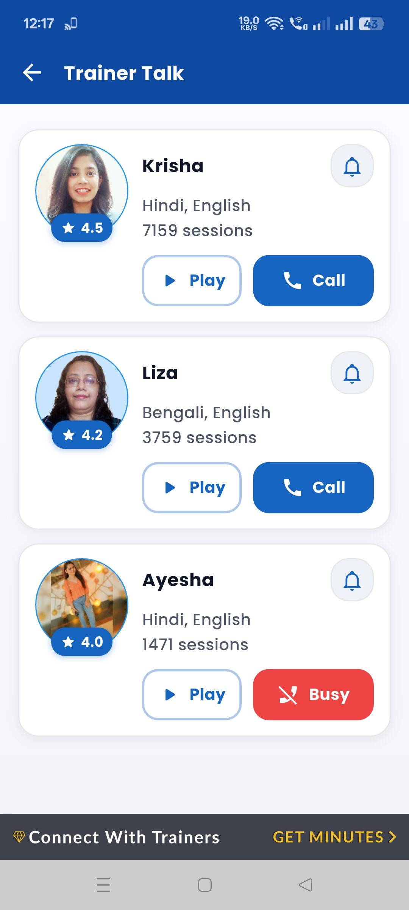

"Trainer Talk" screen: trainer cards with photo, star rating, languages, and session count — Krisha (Hindi/English, 4.5★, 7159 sessions), Liza (Bengali/English, 4.2★, 3759 sessions), Ayesha (Hindi/English, 4.0★, 1471 sessions, marked "Busy"). Each has a "▶ Play" (sample audio) button and a "📞 Call" button (or "Busy" state). Sticky footer: "💎 Connect With Trainers — GET MINUTES →" — trainer calls are metered by purchased minutes.

### 31. 90-Day Spoken English Course — Premium Group Classes detail (repeat visit)

Same "90-Day Spoken English Course" spotlight page as entry 23 (LIVE Spoken English Classes, Unlimited 1:1 Calling with Co-learners, Apply Coupon, $38 total / Pay Now) — revisited later in the session.

### 32. 90-Day Spoken English Course — validity + counsellor CTA (repeat visit)
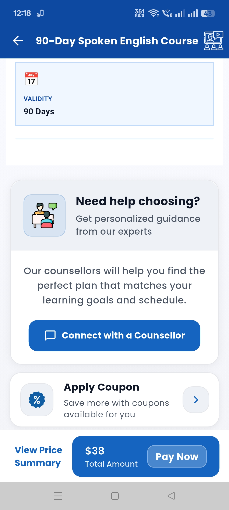

Same validity/"Need help choosing?"/Apply Coupon view as entry 24 ($38 total / Pay Now), revisited.

### 33. Checkout — "Completing your booking" progress state
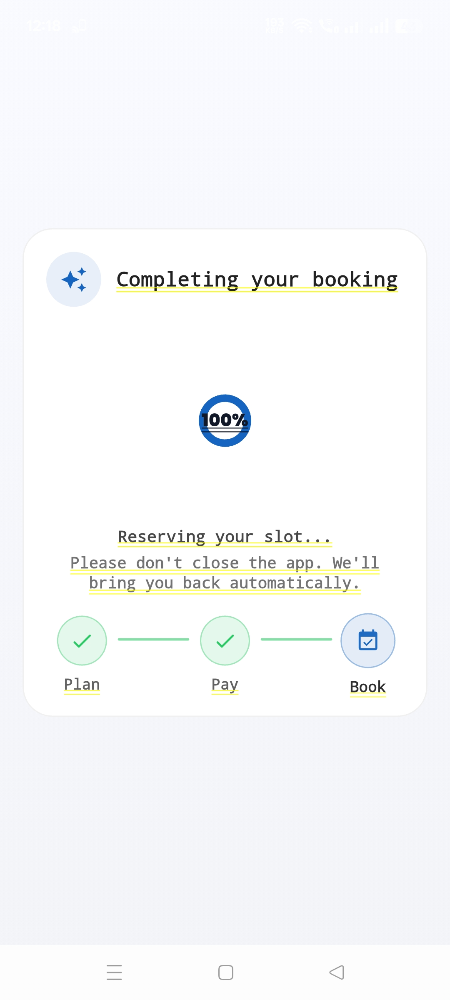

Post-payment processing screen for a trainer session booking: "Completing your booking", a "100%" progress badge, "Reserving your slot…", "Please don't close the app. We'll bring you back automatically." A 3-step tracker (Plan → Pay → Book) shows Plan and Pay complete (green check), Book in progress.

### 34. Razorpay checkout — payment method + contact details
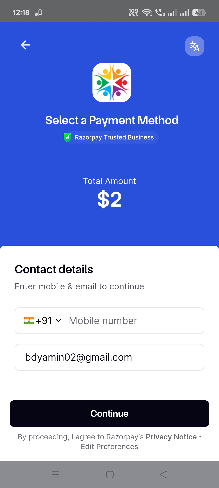

"Select a Payment Method" screen via Razorpay ("Razorpay Trusted Business" badge), Total Amount "$2". Contact details form: mobile number field defaulted to India +91, and a pre-filled email address. "Continue" button and Razorpay privacy-notice/edit-preferences text. Confirms Razorpay as the India-side payment service provider (PSP), distinct from SSLCommerz used for Bangladesh.

### 35. Trainer Profile — Raj, video intro + rating
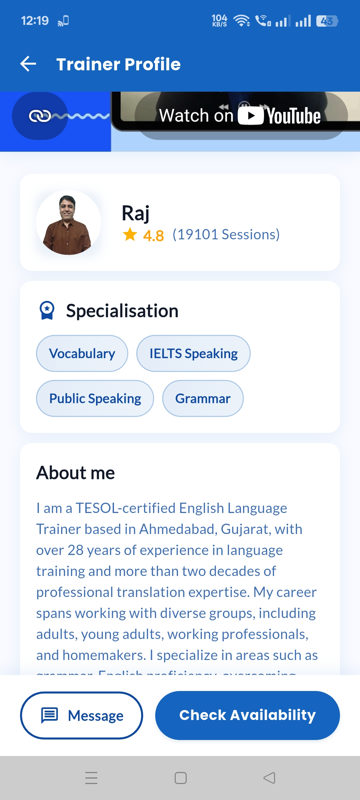

"Trainer Profile" detail page for Raj: embedded "Meet Our Trainer Raj — AceFluency App - Hindi Channel" YouTube video, rating "4.8 (19101 Sessions)", a "Specialisation" tag row (Vocabulary, IELTS Speaking, Public Speaking, Grammar), start of "About me". Footer actions: "Message" and "Check Availability".

### 36. Trainer Profile — Raj, About me bio (scrolled)
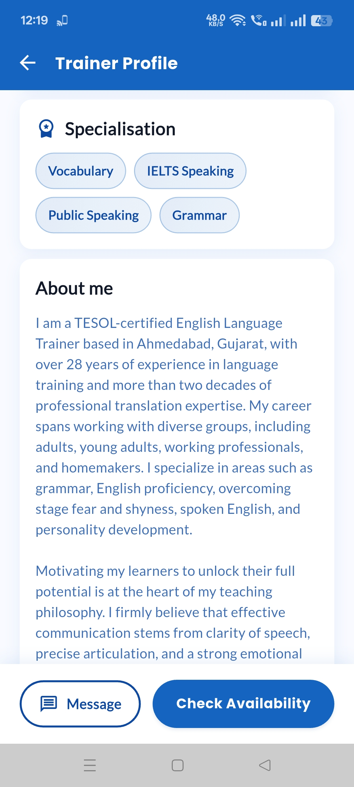

Same Raj profile scrolled to "About me": TESOL-certified bio (Ahmedabad, Gujarat; 28 years' experience; specializes in grammar, English proficiency, stage fear/shyness, spoken English, personality development). "Message" / "Check Availability" footer persists.

### 37. Trainer Profile — Raj, About me bio (further scrolled)

Same bio scrolled further: full first paragraph (TESOL-certified bio) plus the start of a second paragraph, "Motivating my learners to unlock their full potential is at the heart of my teaching philosophy…", cut off mid-sentence.

### 38. Trainer Profile — Raj, About me bio (fully scrolled)
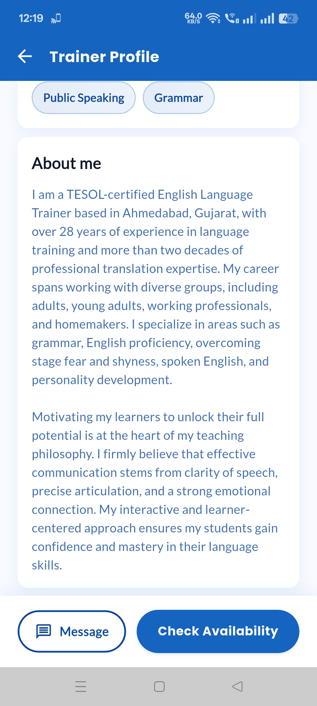

Same page scrolled to the end of the bio: the teaching-philosophy paragraph now fully visible ("...clarity of speech, precise articulation, and a strong emotional connection. My interactive and learner-centered approach ensures my students gain confidence and mastery in their language skills."). Confirms tutor profiles carry a full written bio, not just tags.

### 39. One on One Classes Course — pricing tiers with video intro
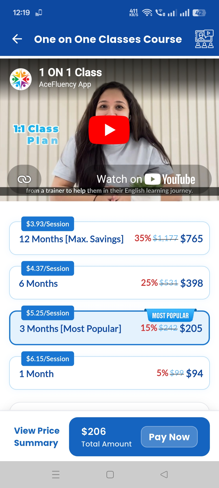

"One on One Classes Course" detail page: embedded "1 ON 1 Class — AceFluency App" intro video ("1:1 Class Plan"). Four duration/pricing tiers, each showing a per-session rate and a struck-through original price: 12 Months [Max. Savings] $3.93/session, 35% off $1,177 → $765; 6 Months $4.37/session, 25% off $531 → $398; 3 Months [Most Popular] $5.25/session, 15% off $242 → $205; 1 Month $6.15/session, 5% off $99 → $94. Sticky footer: $206 total / Pay Now (the 3-month tier appears pre-selected, though total shown doesn't exactly match $205, possibly including tax/fees).

### 40. One on One Classes Course — features and cancellation policy
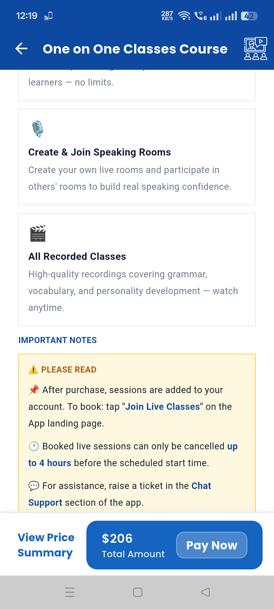

Same course page scrolled to feature list: "Create & Join Speaking Rooms" and "All Recorded Classes", then "IMPORTANT NOTES — PLEASE READ": sessions are added to the account after purchase (book via "Join Live Classes" on the app landing page), booked live sessions can be cancelled up to 4 hours before start, and support is via a Chat Support ticket in the app. Confirms the in-app ticket support system referenced in the PRD.

### 41. One on One Classes Course — Important Notes + counsellor CTA
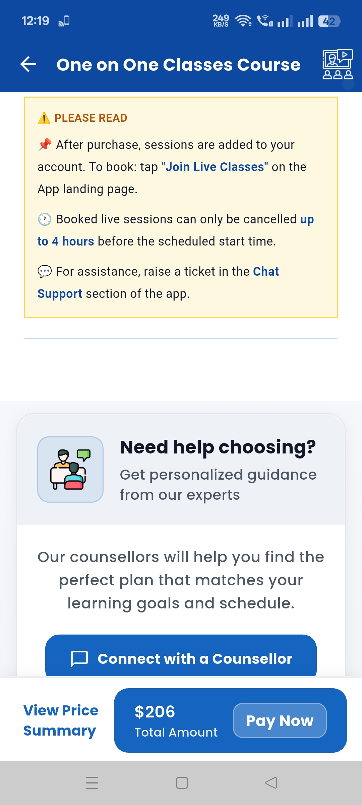

Same course page: "IMPORTANT NOTES — PLEASE READ" card (purchase/booking/cancellation/support policy) followed by the start of a "Need help choosing? — Get personalized guidance from our experts" card. Sticky footer $206 / Pay Now.

### 42. One on One Classes Course — features + Important Notes (repeat scroll)
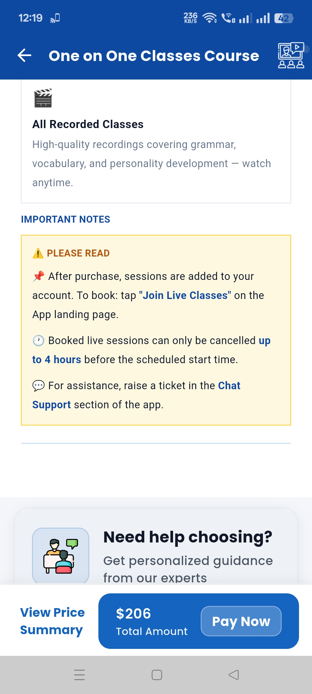

Same page scrolled to a similar position: "All Recorded Classes" feature bullet, then the "IMPORTANT NOTES — PLEASE READ" card again, with "Need help choosing?" starting to appear below.

### 43. One on One Classes Course — counsellor CTA (repeat scroll)
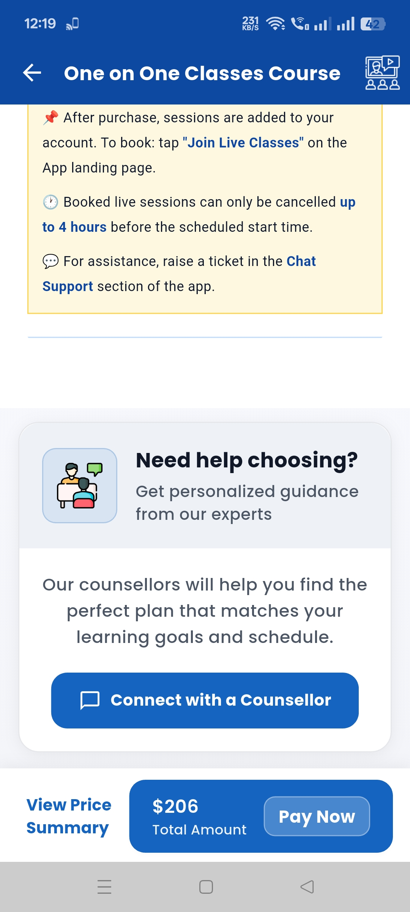

Same page scrolled further: bottom of "IMPORTANT NOTES", then the full "Need help choosing? — Connect with a Counsellor" card. $206 / Pay Now footer persists.

### 44. "Talk with Advanced learners" — eligibility criteria popup
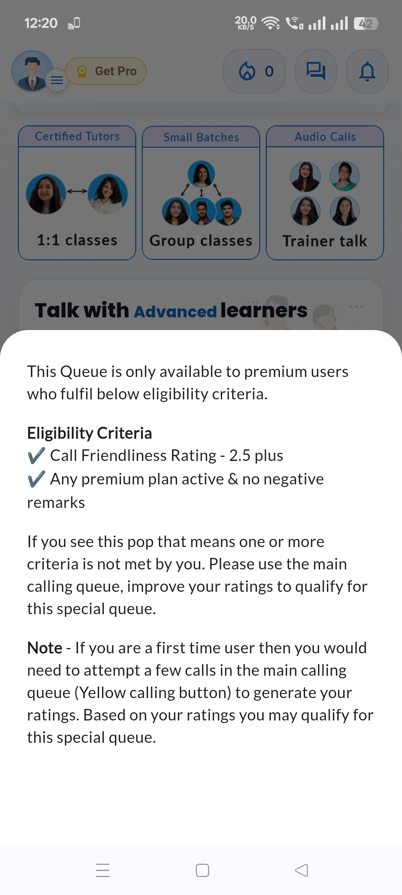

Home tab's Advanced-learner queue triggers an eligibility modal: "This Queue is only available to premium users who fulfil below eligibility criteria." Criteria: "Call Friendliness Rating - 2.5 plus" and "Any premium plan active & no negative remarks." Explains that failing either criterion shows this pop, directs users to the main calling queue to build ratings, and notes first-time users must complete a few main-queue calls (yellow calling button) to generate a rating before qualifying. A previously undocumented gating mechanic tying premium access to behavioral rating, not just payment.

### 45. Recorded Classes — course grid (Video Courses)
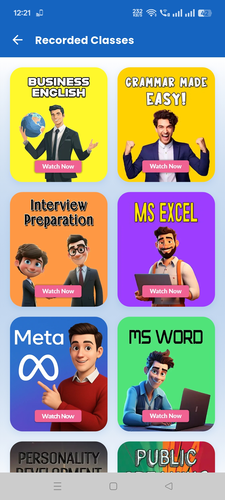

"Recorded Classes" video course grid, each tile a stylized illustrated thumbnail with a pink "Watch Now" button: Business English, Grammar Made Easy!, Interview Preparation, MS Excel, Meta, MS Word, with Personality Development and Public Speaking tiles beginning to show below. Confirms recorded content spans soft-skills/office-tool topics, not just spoken English.

### 46. Audio Learning — Grammar/Vocabulary tabs by level
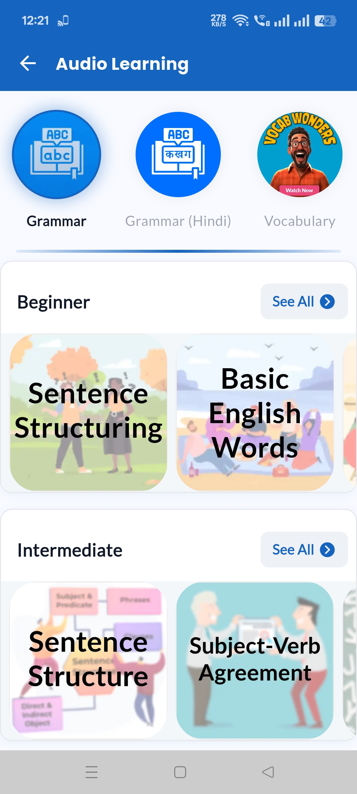

"Audio Learning" screen with category tabs Grammar / Grammar (Hindi) / Vocabulary ("Vocab Wonders" host tile with "Watch Now"). Under the Grammar tab, level-grouped sections each with a "See All" link: "Beginner" (Sentence Structuring, Basic English Words) and "Intermediate" (Sentence Structure, Subject-Verb Agreement).

### 47. Business English Course detail — locked lesson list
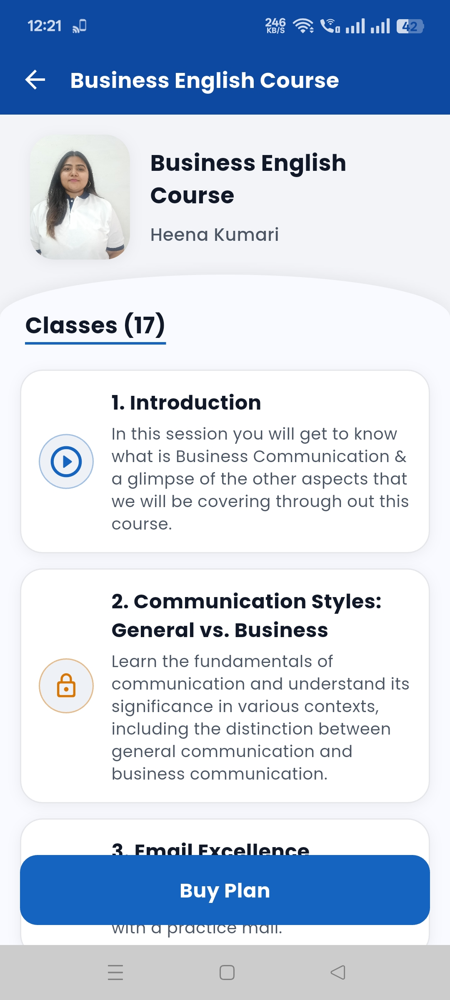

"Business English Course" detail page, instructor "Heena Kumari", "Classes (17)" lesson list: "1. Introduction" is unlocked (play icon, free preview) with a description of the session; "2. Communication Styles: General vs. Business" is locked (padlock icon); "3. Email Excellence" partially visible below. Sticky "Buy Plan" button. Confirms recorded courses gate individual lessons behind purchase, with only the first lesson free.

### 48. Audio Learning — Intermediate/Advanced sections
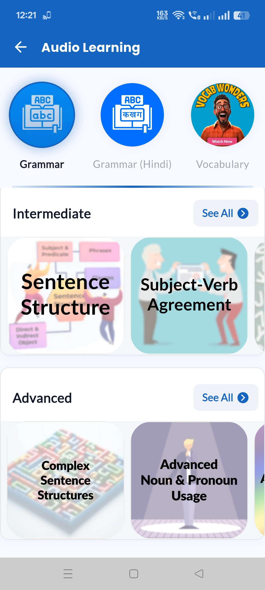

Same Audio Learning screen scrolled to "Intermediate" (Sentence Structure, Subject-Verb Agreement, "See All") and "Advanced" (Complex Sentence Structures, Advanced Noun & Pronoun Usage, "See All") sections — confirms audio content is leveled Beginner → Intermediate → Advanced, mirroring the AI test's difficulty structure.

### 49. Audio lesson player — "Sentence Structuring"
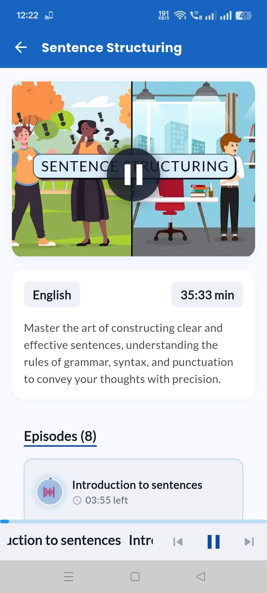

Audio course detail/player for "Sentence Structuring": illustrated cover art with pause control, tags "English" and "35:33 min", a description ("Master the art of constructing clear and effective sentences…"), "Episodes (8)" list beginning with "Introduction to sentences" (03:55 left), and a persistent mini-player bar at the bottom with playback controls.

### 50. Audio lesson player — Episodes list, per-episode locking
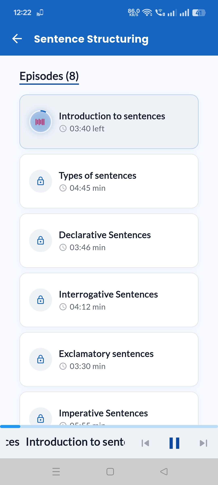

Same "Sentence Structuring" course scrolled to the full "Episodes (8)" list: "Introduction to sentences" is playing/unlocked (03:40 left), while "Types of sentences", "Declarative Sentences", "Interrogative Sentences", "Exclamatory sentences", and "Imperative Sentences" all show a padlock icon with their durations. Confirms audio courses use the same first-episode-free, rest-locked pattern as video courses (entry 47).

### 51. Classes tab — trial booking carousel (Mira)
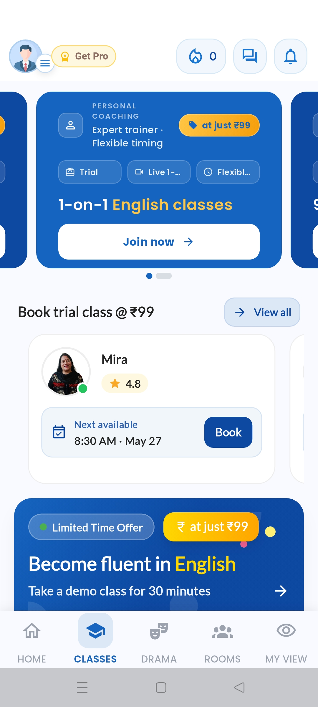

Classes tab, same "Personal Coaching" carousel and "Book trial class @ ₹99" section as entries 5–6, this time surfacing tutor Mira (4.8★, next available 8:30 AM · May 27) with a "Book" button, plus the "Limited Time Offer — Become fluent in English" banner below.

### 52. Explore Trainers — filterable list with a broken avatar image
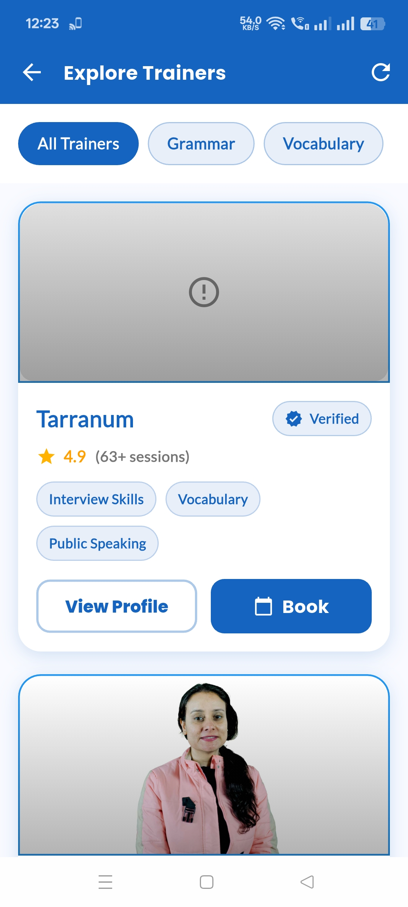

"Explore Trainers" screen with filter chips "All Trainers / Grammar / Vocabulary" and a refresh icon. First trainer card, "Tarranum" (4.9★, 63+ sessions, "Verified" badge, tags Interview Skills/Vocabulary/Public Speaking, "View Profile"/"Book" buttons), renders with a broken-image placeholder (gray box with an exclamation icon) instead of her photo — a real image-loading defect in the existing app, notable prior art for the rebuild's image-handling.

### 53. Explore Trainers — Raj card (scrolled)
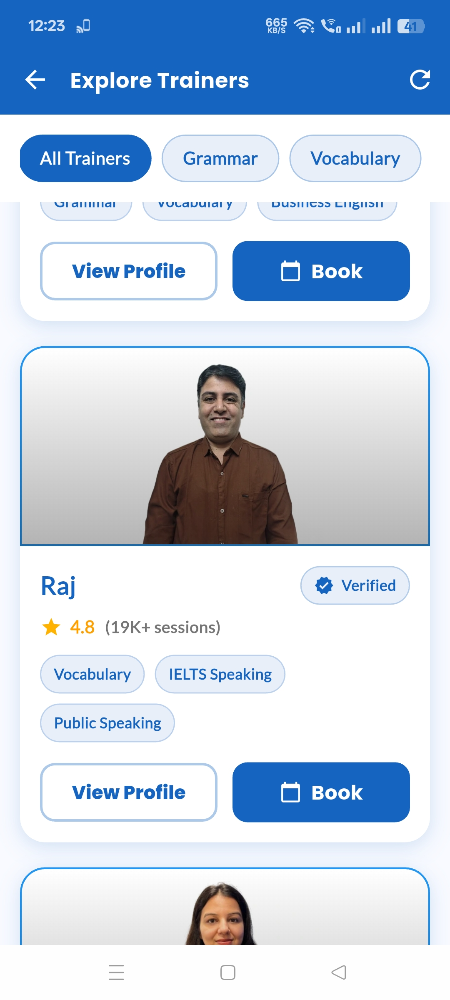

Same Explore Trainers list scrolled: Raj (4.8★, 19K+ sessions, Verified, tags Vocabulary/IELTS Speaking/Public Speaking) with a correctly loaded photo this time, "View Profile"/"Book" buttons, and the next trainer card beginning below.

### 54. English Room — Upcoming Rooms + Other Live Rooms
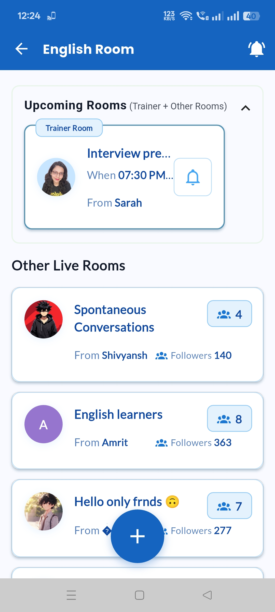

"English Room" category listing: "Upcoming Rooms (Trainer + Other Rooms)" expanded showing the "Interview pre…" Trainer Room from Sarah (07:30 PM), and "Other Live Rooms": "Spontaneous Conversations" (from Shivyansh, 4 cap, 140 followers), "English learners" (from Amrit, 8 cap, 363 followers), "Hello only frnds 🙃" (7 cap, 277 followers).

### 55. Live room in-session — "Ludo 😝" with recording + participant moderation
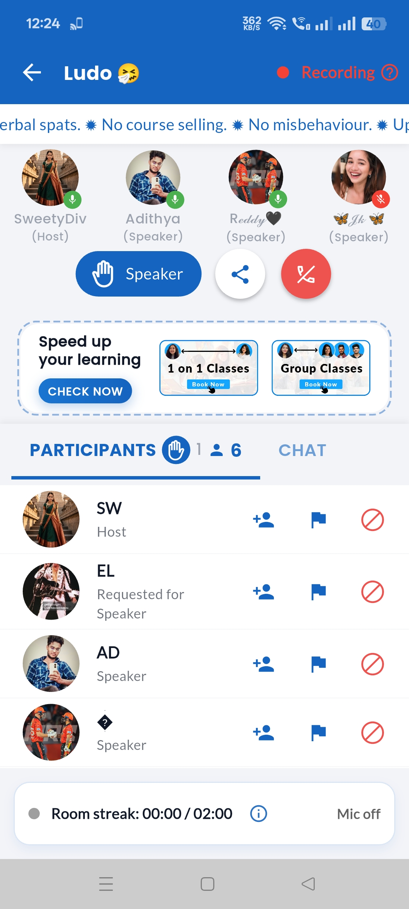

Active voice room "Ludo 😝" with a red "Recording ⓘ" indicator and a scrolling ground-rules ticker ("…verbal spats. No course selling. No misbehaviour. Up…"). Speaker tiles: SweetyDiv (Host), Adithya (Speaker), Reddy♥ (Speaker), Jk (Speaker, muted). Controls: raise-hand "Speaker" request, share, red leave-room button. An in-room upsell card "Speed up your learning — CHECK NOW" promotes 1 on 1 Classes / Group Classes. Below, tabs "PARTICIPANTS (✋1 👤6) / CHAT" list each participant with add-friend, flag (report), and block icons — confirms per-participant moderation tools already exist in live rooms. Footer shows "Room streak: 00:00 / 02:00" and mic status.

### 56. Live room in-session — "Spontaneous Conversations"
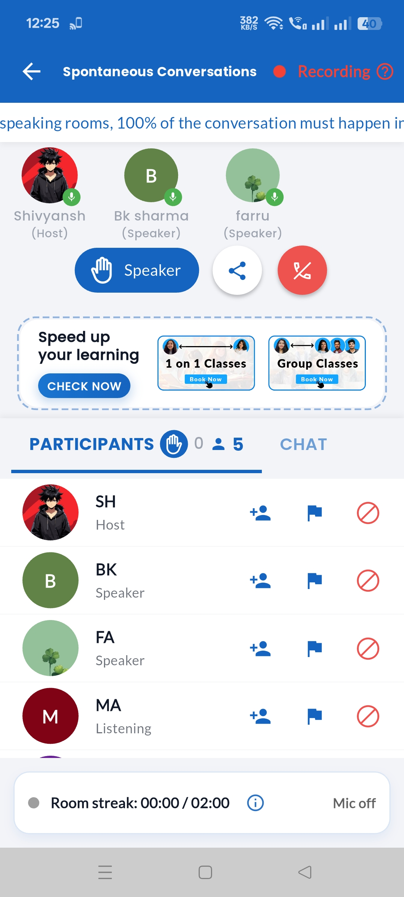

Another active voice room, "Spontaneous Conversations": "Recording" indicator, rules ticker ("…speaking rooms, 100% of the conversation must happen in…"). Speaker tiles: Shivyansh (Host), Bk sharma (Speaker), farru (Speaker). Same Speaker/Share/Leave controls and "Speed up your learning" 1-on-1/Group Classes upsell card. "PARTICIPANTS (✋0 👤5) / CHAT" tabs list SH (Host), BK (Speaker), FA (Speaker), MA (Listening) with add/flag/block icons; "Room streak: 00:00 / 02:00", mic off.

### 57. "Complete today's streak" action-choice modal
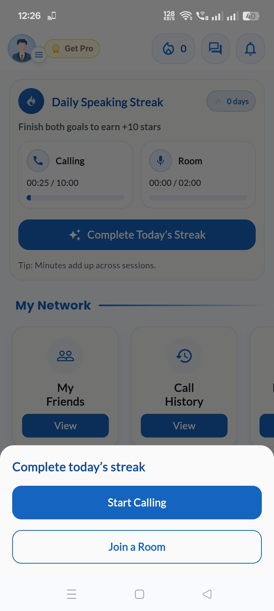

My View tab's Daily Speaking Streak card (Calling 00:25/10:00 now has partial progress, Room 00:00/02:00) with a bottom-sheet modal triggered by "Complete Today's Streak": "Complete today's streak" heading, two options — "Start Calling" and "Join a Room" — letting the user pick which streak goal to pursue.

### 58. Friends — empty state
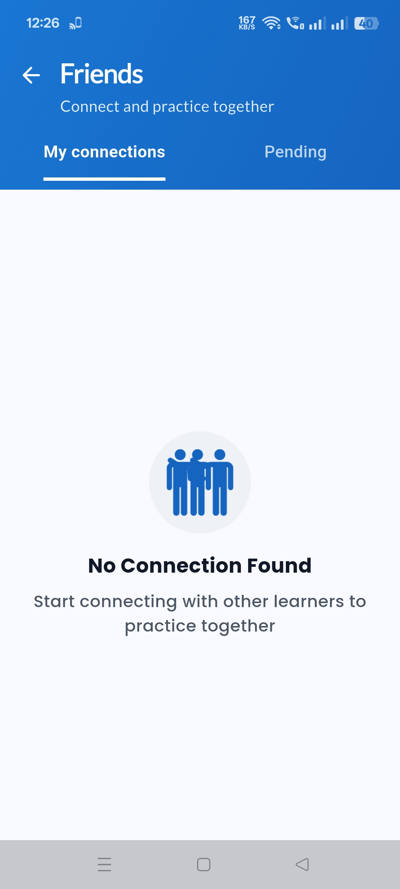

"Friends — Connect and practice together" screen with "My connections" / "Pending" tabs. Empty state: "No Connection Found — Start connecting with other learners to practice together." Confirms the friend graph has a request/pending model, not instant mutual add.

### 59. Call History — list with disconnect attribution
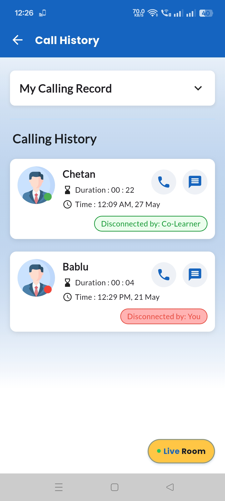

"Call History" screen, "My Calling Record" dropdown, "Calling History" list: Chetan (00:22 duration, 12:09 AM 27 May, tagged "Disconnected by: Co-Learner" in green) and Bablu (00:04 duration, 12:29 PM 21 May, tagged "Disconnected by: You" in red), each with call-back and message icons. Floating "🟢 Live Room" pill bottom-right. Confirms each call record attributes who ended the call — directly relevant to disconnect-complaint/strike-fairness handling (UJ-3 in the ratings analysis).

### 60. AI Speaking Test — "My Hometown", idle before recording
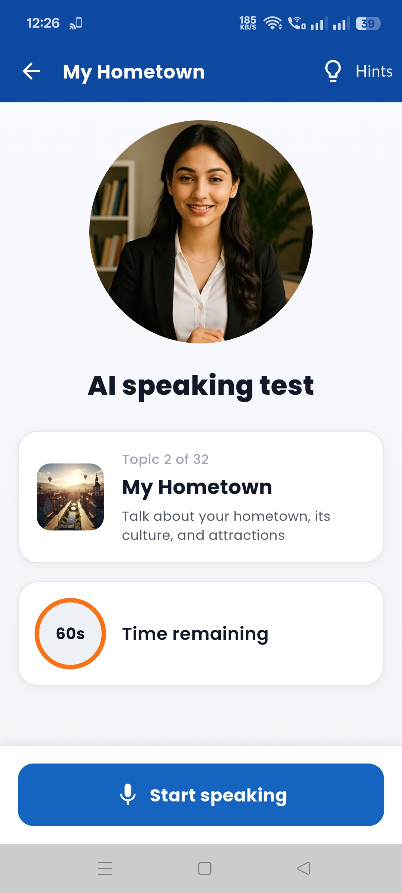

AI Speaking Test for "Topic 2 of 32 — My Hometown" ("Talk about your hometown, its culture, and attractions"), 60s timer not yet started, "🎤 Start speaking" button idle.

### 61. AI Speaking Test — "My Hometown", recording in progress
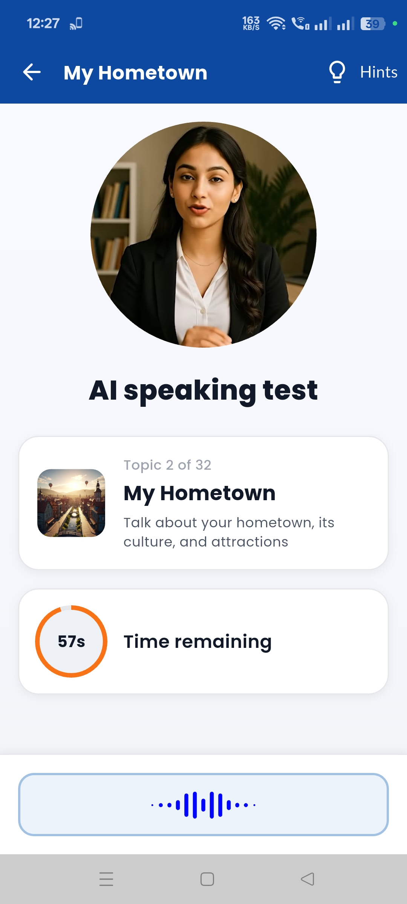

Same test mid-recording: timer counted down to 57s, the Start button replaced by a live audio waveform visualizer — confirms real-time recording feedback during the speaking test.

### 62. AI Speaking Test — "My Hometown", recording near end
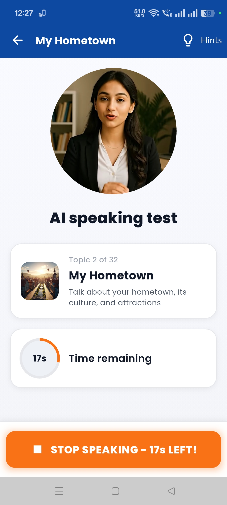

Same test with 17s remaining: button changes to an urgent orange "⏹ STOP SPEAKING – 17s LEFT!" state, prompting the user to wrap up before time runs out.

### 63. AI Speaking Test — time expired, ready to submit
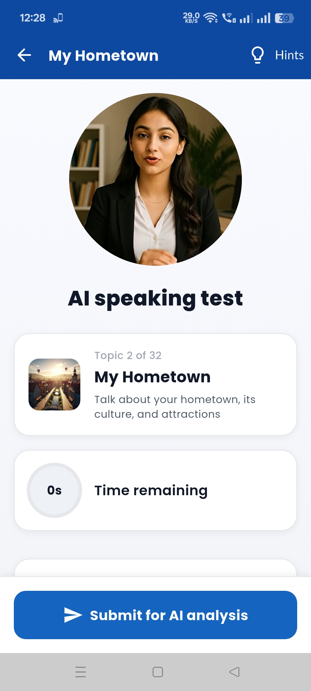

Same "My Hometown" test with the timer at 0s and the action button now "➤ Submit for AI analysis" — the recording phase has ended and the user can send it off for scoring.

### 64. AI Speaking Test — "Analyzing…" loading state
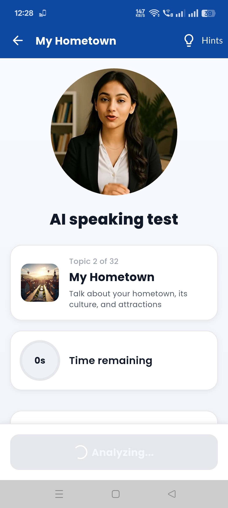

Same screen immediately after tapping submit: the button becomes a disabled "Analyzing…" spinner state while the AI scores the response.

### 65. AI Speaking Test results — transcript + overall feedback
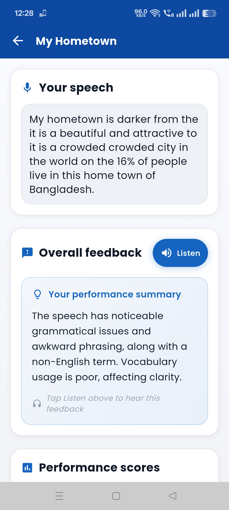

Results screen: "Your speech" shows the transcribed answer verbatim (a rough, grammatically broken response about "my hometown"). "Overall feedback" card has a "🔊 Listen" button (audio readback of the feedback) and a "Your performance summary" blurb: "The speech has noticeable grammatical issues and awkward phrasing, along with a non-English term. Vocabulary usage is poor, affecting clarity." "Performance scores" section begins below.

### 66. AI Speaking Test results — Performance scores + chart
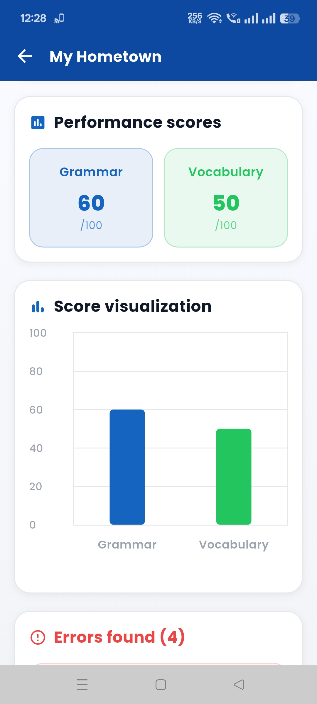

"Performance scores": Grammar 60/100, Vocabulary 50/100, plus a "Score visualization" bar chart plotting both. "Errors found (4)" section heading starts below — confirms the AI assessment scores at least Grammar and Vocabulary dimensions with a visual breakdown.

### 67. AI Speaking Test results — Errors found, detail 1
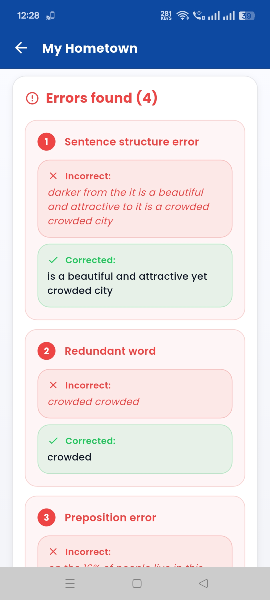

"Errors found (4)" detail list, each with an Incorrect/Corrected pair: "1. Sentence structure error" and "2. Redundant word" ("crowded crowded" → "crowded"), with "3. Preposition error" beginning below. Confirms the AI gives granular, per-error corrections, not just a score.

### 68. AI Speaking Test results — Errors found, detail 2
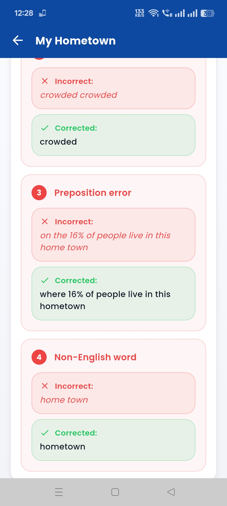

Continuation of the errors list: "3. Preposition error" ("on the 16% of people live in this home town" → "where 16% of people live in this hometown") and "4. Non-English word" ("home town" → "hometown").

### 69. My Streak — full streak detail screen
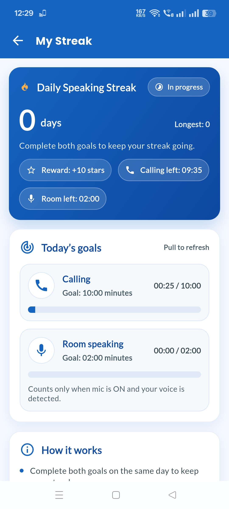

Dedicated "My Streak" screen (reached from the Daily Speaking Streak card): "0 days" current streak, "In progress" badge, "Longest: 0", "Reward: +10 stars", "Calling left: 09:35", "Room left: 02:00". "Today's goals" section: Calling (00:25/10:00) and Room speaking (00:00/02:00, note "Counts only when mic is ON and your voice is detected"), each with a progress bar. "How it works" section begins below.

### 70. My Streak — rules + social share card
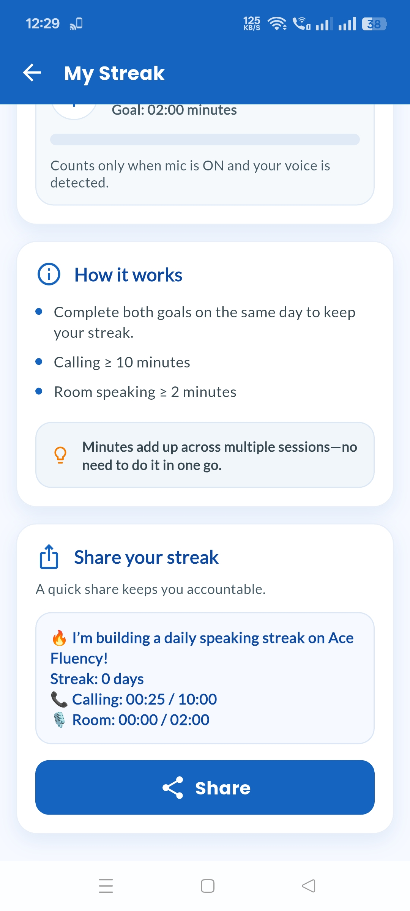

Same screen scrolled: "How it works" bullets ("Complete both goals on the same day to keep your streak", "Calling ≥ 10 minutes", "Room speaking ≥ 2 minutes", "Minutes add up across multiple sessions—no need to do it in one go"). "Share your streak" card with a pre-filled share message ("🔥 I'm building a daily speaking streak on Ace Fluency! Streak: 0 days 📞 Calling: 00:25/10:00 🎙️ Room: 00:00/02:00") and a "Share" button — a built-in virality/referral loop.

### 71. Student Support — app support + counsellor upsell
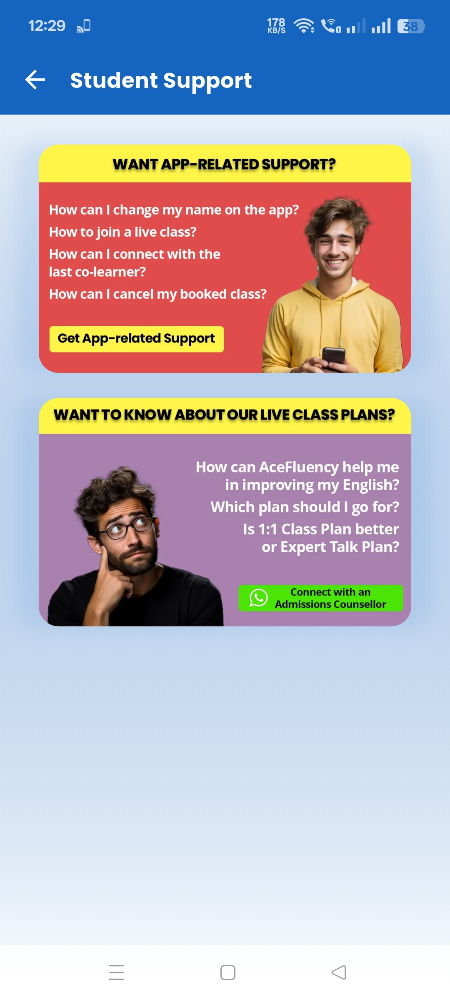

"Student Support" screen: "WANT APP-RELATED SUPPORT?" card lists example questions ("How can I change my name on the app?", "How to join a live class?", "How can I connect with the last co-learner?", "How can I cancel my booked class?") with a "Get App-related Support" button. Below, "WANT TO KNOW ABOUT OUR LIVE CLASS PLANS?" card ("Which plan should I go for?", "Is 1:1 Class Plan better or Expert Talk Plan?") with a "Connect with an Admissions Counsellor" WhatsApp button — the same WhatsApp counsellor pattern seen on course pages (entries 22, 25).

### 72. FAQs — accordion list
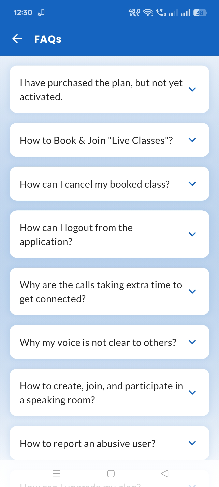

"FAQs" screen, collapsed accordion questions: "I have purchased the plan, but not yet activated.", "How to Book & Join 'Live Classes'?", "How can I cancel my booked class?", "How can I logout from the application?", "Why are the calls taking extra time to get connected?", "Why my voice is not clear to others?", "How to create, join, and participate in a speaking room?", "How to report an abusive user?", with "How can I upgrade my plan?" starting to show. Directly mirrors several complaint categories from the Play Store reviews (login/session issues, call connection delays, audio quality).

### 73. Notifications — empty state
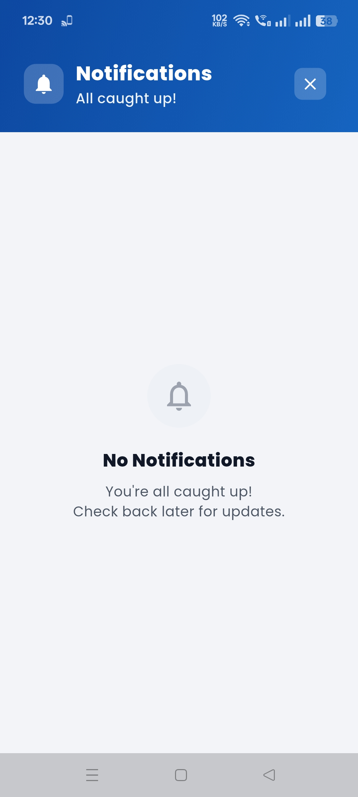

"Notifications" panel, "All caught up!" subtitle, empty-state illustration: "No Notifications — You're all caught up! Check back later for updates."

### 74. Account — profile header + streak summary
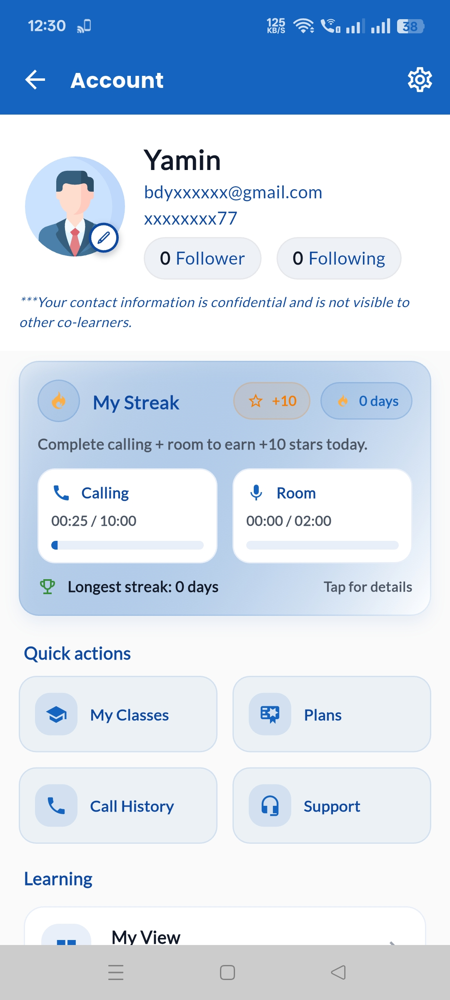

"Account" screen: profile photo (editable), name "Yamin", masked email and phone number, "0 Follower / 0 Following", a privacy note ("Your contact information is confidential and is not visible to other co-learners"). "My Streak" summary card repeats the Daily Streak data (+10 reward, 0 days, Calling 00:25/10:00, Room 00:00/02:00, "Longest streak: 0 days", "Tap for details"). "Quick actions" grid: My Classes, Plans, Call History, Support. "Learning" section begins with "My View".

### 75. Account — Learning section (full menu)
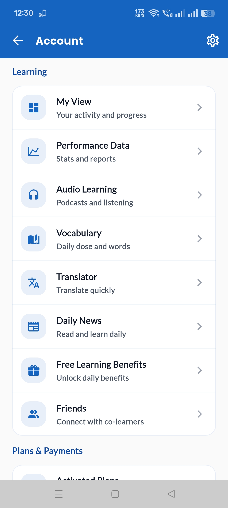

Account screen's "Learning" menu: My View ("Your activity and progress"), Performance Data ("Stats and reports"), Audio Learning ("Podcasts and listening"), Vocabulary ("Daily dose and words"), Translator ("Translate quickly"), Daily News ("Read and learn daily"), Free Learning Benefits ("Unlock daily benefits"), Friends ("Connect with co-learners") — several of these (Translator, Daily News, Performance Data, Vocabulary) are features not surfaced anywhere else in the reviewed screenshots. "Plans & Payments" section begins below.

### 76. Account — Plans & Payments + Support & Legal (top)
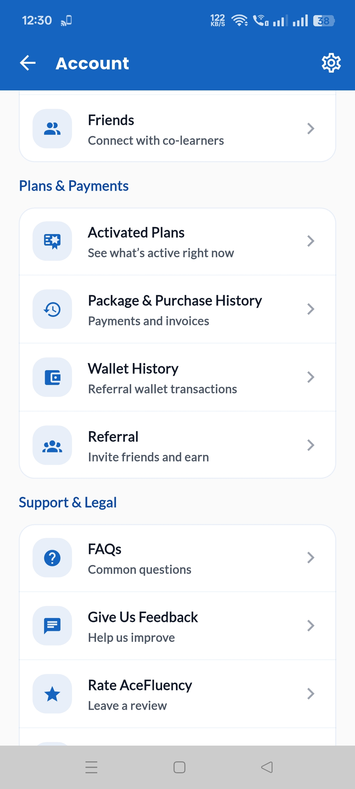

"Plans & Payments": Activated Plans ("See what's active right now"), Package & Purchase History ("Payments and invoices"), Wallet History ("Referral wallet transactions"), Referral ("Invite friends and earn") — confirms a referral-wallet system exists. "Support & Legal" begins: FAQs, Give Us Feedback, Rate AceFluency.

### 77. Account — Support & Legal (full) + social links
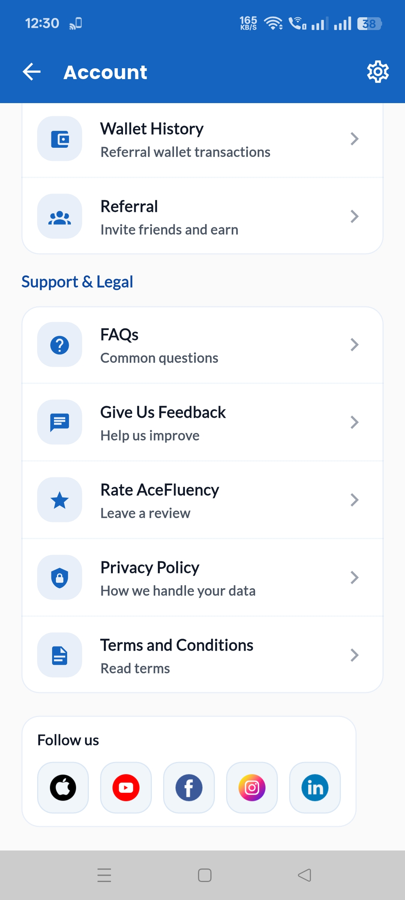

Continuation of "Support & Legal": FAQs, Give Us Feedback, Rate AceFluency, Privacy Policy, Terms and Conditions. "Follow us" row with social icons: Apple (App Store), YouTube, Facebook, Instagram, LinkedIn.

### 78. Classes tab — Filter bottom sheet
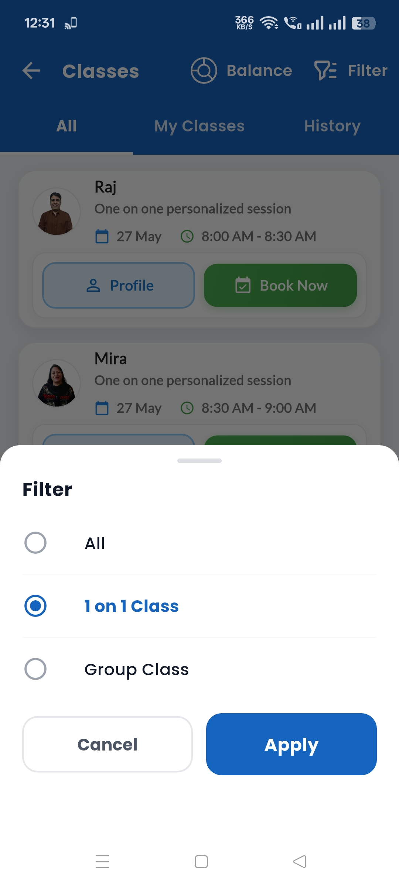

Classes tab (same booking list as entry 26) with a "Filter" bottom sheet open: radio options "All", "1 on 1 Class" (selected), "Group Class", with "Cancel" and "Apply" buttons.
